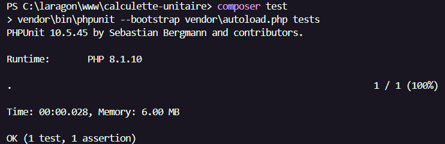
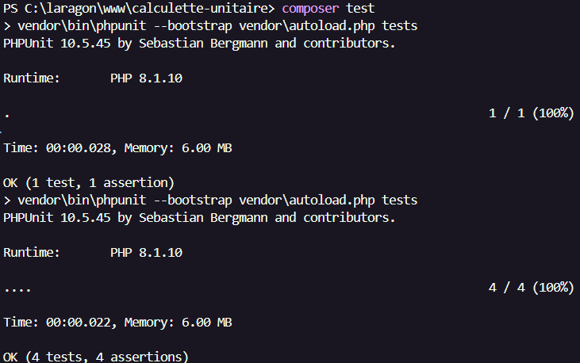
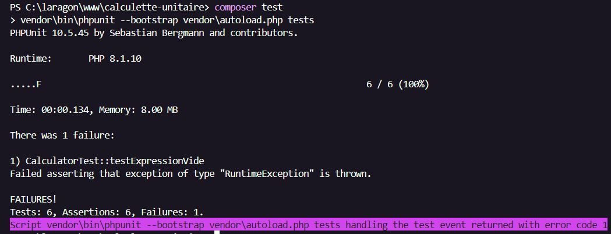
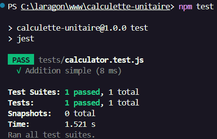
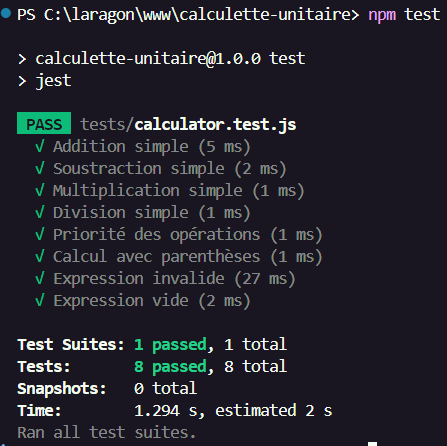

# Calculette Unitaire - Tests PHPUnit & Jest 💪

## 🎯 Objectif

Réaliser une série de tests unitaires pour deux interfaces de calculatrice :
- Une en PHP avec PHPUnit
- Une en JavaScript avec Jest

---

## ⚙️ Structure du projet

```
calculette-unitaire/
├── calculator.php
├── calculator.js
├── calculator.css
├── Calculator_PHP.php
├── Calculator_JS.html
├── tests/
│   ├── CalculatorTest.php
│   └── calculator.test.js
├── images/
└── README.md
```

---

## ✅ Partie PHP - PHPUnit

### 🔸 Test d’addition



### 🔸 Autres opérations



### 🔸 Cas d’erreurs



---

## ✅ Partie JS - Jest

### 🔸 Test d’addition



### 🔸 Tests complets



---

## 🔍 Tests réalisés

### PHP
- [x] Addition
- [x] Soustraction
- [x] Multiplication
- [x] Division
- [x] Division par zéro
- [x] Chaîne vide

### JavaScript
- [x] Addition
- [x] Soustraction
- [x] Multiplication
- [x] Division
- [x] Priorité des opérations
- [x] Parenthèses
- [x] Expression invalide
- [x] Expression vide

---

## 🚀 Commandes utiles

### PHP (via Composer)
```bash
composer test
```

### JavaScript (via Jest)
```bash
npm test
```

---

## 🧠 Compétences acquises

- Utilisation de PHPUnit avec Composer
- Utilisation de Jest avec Node.js
- Structuration claire des fichiers de test
- Validation des erreurs et cas limites
- Documentation en Markdown avec captures d’écran